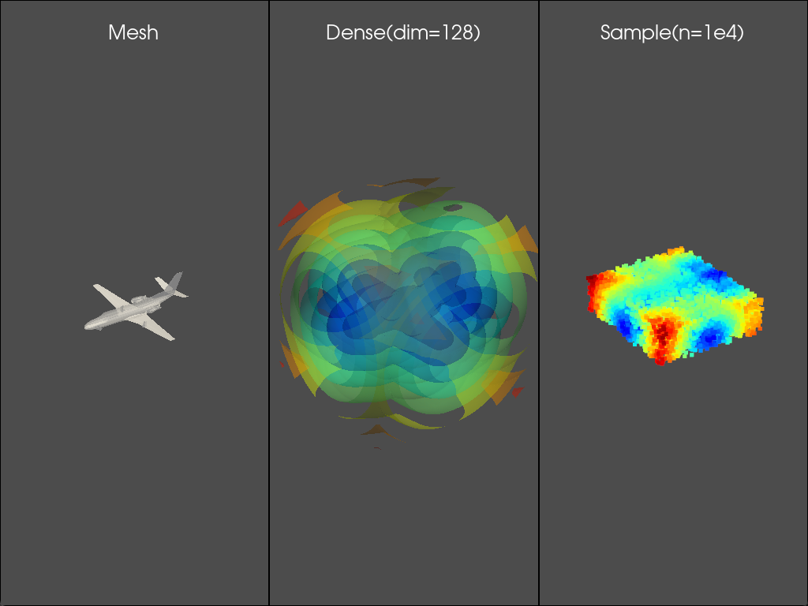
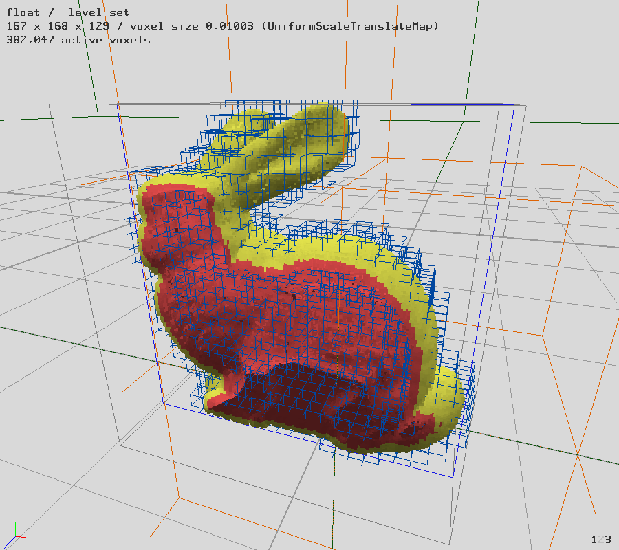
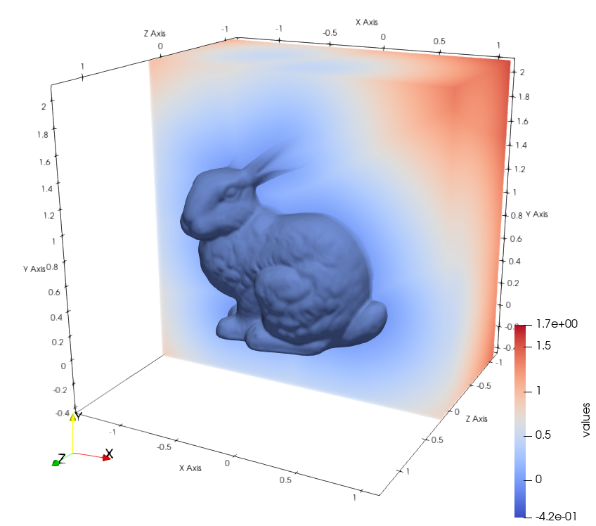
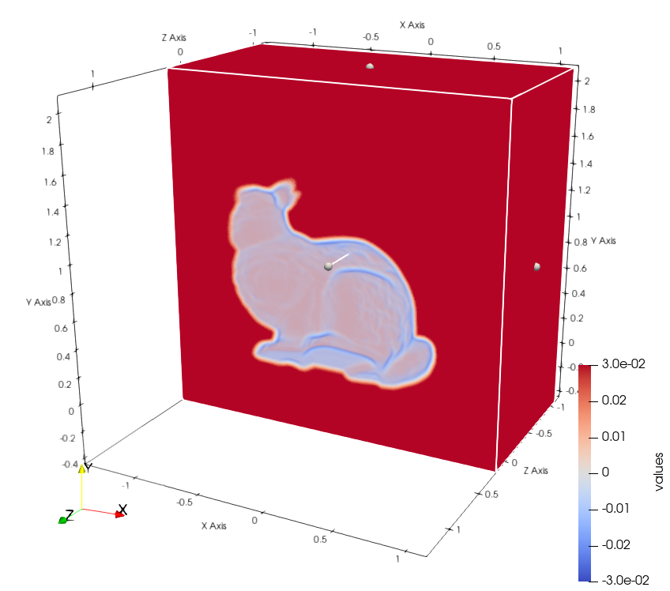
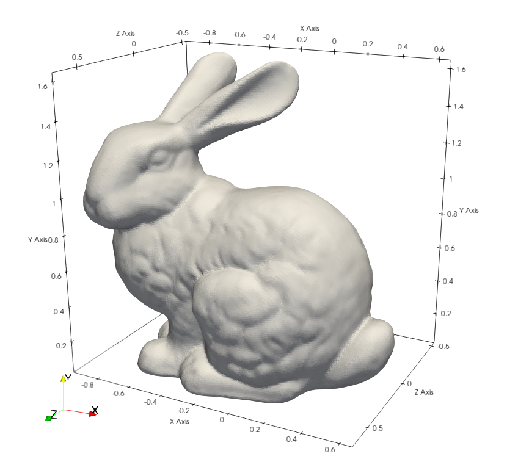

# Mesh2Volume

Tools for converting mesh to signed distance field volume (Mesh2SDF) using [OpenVDB](https://github.com/AcademySoftwareFoundation/openvdb).

```
conda install openvdb mesh2volume -c zilch
```

## 1. Build from source

### 1.1. Build OpenVDB

```bash
# windows dependencies
conda create -n openvdb cmake compilers boost-cpp tbb-devel blosc zlib python=3.9 pybind11
# unix dependencies
conda create -n openvdb cmake make compilers boost-cpp tbb-devel blosc zlib jemalloc python=3.9 pybind11
conda activate openvdb

# build and install openvdb in the conda environment
git clone https://github.com/AcademySoftwareFoundation/openvdb.git
cd openvdb && mkdir build && cd build

# unix bash
cmake .. -DCMAKE_INSTALL_PREFIX=${CONDA_PREFIX}
# windows powershell
cmake .. -DCMAKE_INSTALL_PREFIX=$env{CONDA_PREFIX}/Library
# windows cmd
# cmake .. -DCMAKE_INSTALL_PREFIX=%CONDA_PREFIX%/Library

cmake --build . --config release -j --target install
```

### 1.2. Build and intall Python module or binary tools

```bash
# build python module
cd python
conda activate openvdb
python -m pip install .

# build binary tools
cd tools 
conda activate openvdb
cmake --build . --config release -j --target install
```


## 2. Usage

### 2.1. Python module (Recommended)

```python
import mesh2volume
# mesh vertices,faces,bbox and volume dimensions
volume = mesh2volume.Volume(V,F,B,D) 
# to (D,D,D) dense sdf volume
sdf,origin,spacing = volume.to_dense() 
# to (#P) sdf samples
sdf = volume.sample(P) 
```

See the example in `example/module.py`. 

```bash
conda activate openvdb
pip install numpy trimesh pyvista matplotlib
python example/module.py
```



### 2.2. Tools (Deprecated)

All tools are available in the created conda environment only:
- **mesh2volume**: Convert Wavefront *.obj* mesh to sparse and narrow-band *.vdb* volume or dense *.vtk* volume.
- **vdb2vtk**: Convert sparse and narrow-band *.vdb* volume to dense *.vtk* volume.
- **vdb2mesh**: Convert sparse and narrow-band *.vdb* volume to Wavefront *.obj* mesh.

Run `target --help` to check more options.

1. Mesh2VDB: The result can be visualized by Houdini, Maya and `vdb_view` from OpenVDB. 


    ```bash
    conda activate openvdb
    mesh2volume ./assets/bunny.obj # ./assets/bunny.obj.vdb --dim 256 --bw 3
    ```
    
    

2. Mesh2VTK: The result can be visualized by VTK, Paraview.

    ```bash
    mesh2volume ./assets/bunny.obj --full --dense # ./assets/bunny.obj.vtk` --dim 256
    ```

    

3. VDB2VTK: Specify dimension or bounding box to crop the *.vdb* volume.


    ```bash
    vdb2vtk ./assets/bunny.obj.vdb # ./assets/bunny.obj.vdb.vtk --dim 256
    ```

    

4. VDB2Mesh: The result is a mesh mixed with quad and triangle faces.

    ```bash
    vdb2mesh ./assets/bunny.obj.vtk # ./assets/bunny.obj.vtk.obj --iso 0 --adapt 0
    ```

    

